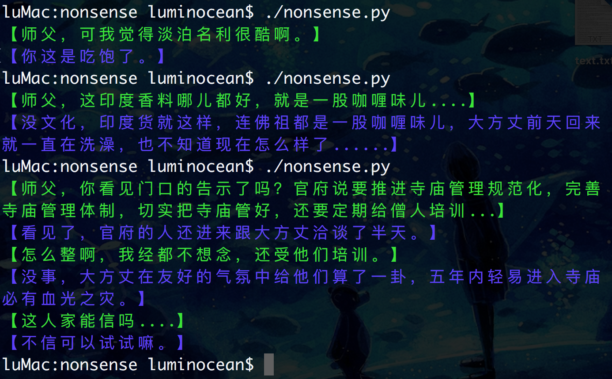

# 这是什么？

这是发生在一座寺庙里的对话，对话的人是一对叫澈丹和空舟的师徒...

内容取自于《扯经》，作者微博@自扯自蛋

我很喜欢这本书。受unix工具fortune的启发，也将这本书的片段制作成了这个小工具，取名nonsense。

为了区分对话，还给对话加了点颜色。
(请原谅我对颜色的审美 :P)

# 使用方式

安装Python3后执行`./nonsense.py`即可。也可以使用`python nonsense.py`执行。

可以把它加到你的PATH路径中，代码写累了就来一段放松放松吧

# 效果

# License

《扯经》全文版权归原创者自扯自蛋所有，采用请注意许可。个人转载时请遵循 “署名、非商业用途、内容保持一致”的共用协议；商业网站或未授权媒体如需转载，请联系新浪微博账号@自扯自蛋 授权，并支付版权费用。

本工具使用MIT协议
